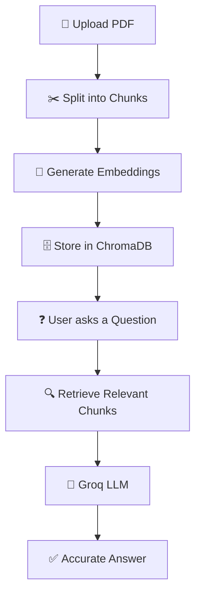

<div align="center">

# 🤖 AI-Powered Document Assistant

### A Retrieval-Augmented Generation (RAG) chatbot for your PDFs

[](https://vishvasmetaliya.streamlit.app/)
[](https://youtu.be/F06QQRH2s1A)
[](https://github.com/vishvasmetaliya07/AI_power_Documents_Assitance_using_Rag)


</div>

---

## 📖 Overview

**AI-Powered Document Assistant** is a Retrieval-Augmented Generation (RAG) application that lets you upload a PDF and chat with it in plain English.

Instead of scrolling through pages looking for one paragraph, you ask a question — the app retrieves the most relevant chunks of the document and uses a large language model to generate an accurate, context-aware answer.

---

## 🔗 Quick Links

| | |
|---|---|
| 🌐 **Live App** | [vishvasmetaliya.streamlit.app](https://vishvasmetaliya.streamlit.app/) |
| 🎥 **Demo Video** | [Watch on YouTube](https://youtu.be/F06QQRH2s1A) |
| 💻 **Source Code** | [GitHub Repository](https://github.com/vishvasmetaliya07/AI_power_Documents_Assitance_using_Rag) |

---

## ✨ Features

- 📄 Upload and parse PDF documents
- 💬 Chat with your documents in natural language
- 🔍 Semantic search powered by vector embeddings
- 🤖 Retrieval-Augmented Generation (RAG) pipeline
- ⚡ Fast, accurate responses via Groq LLM
- 🧠 Context-aware retrieval — no hallucinated answers from unrelated text
- 📚 Persistent vector storage with ChromaDB
- 🔒 Secure API key management via `.env`
- 🎨 Clean, responsive Streamlit interface

---

## 🛠 Tech Stack

| Layer | Technology |
|---|---|
| Language | Python |
| UI | Streamlit |
| Orchestration | LangChain |
| LLM | Groq (Llama) |
| Vector Store | ChromaDB |
| Embeddings | HuggingFace Sentence-Transformers |
| PDF Parsing | PyPDF |
| Config | python-dotenv |

---

## 🧩 How It Works



---

## 📁 Project Structure

```text
AI_power_Documents_Assitance_using_Rag/
│
├── app.py             # Streamlit application entry point
├── main.py             # Core RAG pipeline logic
├── requirements.txt    # Project dependencies
├── README.md
├── .env                 # API keys (not committed)
└── ChromaDB/            # Persisted vector store
```

---

## ⚙️ Installation

```bash
# 1. Clone the repository
git clone https://github.com/vishvasmetaliya07/AI_power_Documents_Assitance_using_Rag.git
cd AI_power_Documents_Assitance_using_Rag

# 2. Create and activate a virtual environment
python -m venv venv

# Windows
venv\Scripts\activate

# Linux / macOS
source venv/bin/activate

# 3. Install dependencies
pip install -r requirements.txt
```

Create a `.env` file in the project root:

```env
GROQ_API_KEY=your_groq_api_key
```

Run the app:

```bash
streamlit run main.py
```

---

## 🔮 Roadmap

- [ ] 📂 Multi-document support
- [ ] 💾 Persistent chat history
- [ ] 📑 Source citations for each answer
- [ ] 🖼 OCR support for scanned PDFs
- [ ] 🎙 Voice-based interaction
- [ ] 🌍 Multi-language support
- [ ] ☁️ Cloud-hosted vector database
- [ ] 📱 Mobile-responsive UI

---

## 🤝 Contributing

Contributions are welcome!

```bash
# 1. Fork the repository
# 2. Create a feature branch
git checkout -b feature-name

# 3. Commit your changes
git commit -m "Added new feature"

# 4. Push and open a Pull Request
git push origin feature-name
```

---

## 👨‍💻 Author

<div align="center">

### Vishvas Metaliya

[](https://github.com/vishvasmetaliya07)
[](https://www.linkedin.com/in/vishvas-metaliya/)

</div>

---

<div align="center">

### ⭐ If you found this project useful, consider giving it a star — it helps others discover it.

**Made with Python • Streamlit • LangChain • ChromaDB • Groq LLM**

</div>
